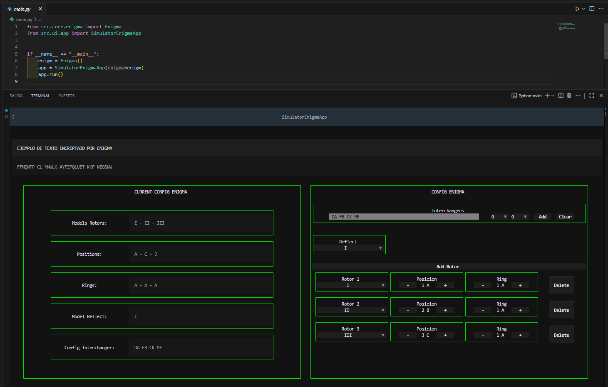

# Simulator Enigma Machine con Textual

- Este es un proyecto de simulador de maquina enigma desarrollado en Python usando la libreria de aplicaciones en terminal Textual

# Funcionalidades
- Encriptar y desencriptar texto siguiendo el modelo de enigma
- Configuracion de la maquina enigma
- Interface Textual de visualizacion y modificacion de la configuracion

## 📥 Clonar el repositorio

Para clonar el repositorio en tu máquina local, ejecuta el siguiente comando en tu terminal:

```sh
 git clone https://github.com/Paul-Asto/Simulator_Enigma_Machine_Python_Textual.git
 cd Game-Tetris-in-Python-Textual
```

## 🛠️ Crear y activar un entorno virtual

Es recomendable utilizar un entorno virtual para gestionar las dependencias del proyecto.

### 🔹 En Windows (CMD o PowerShell)
```sh
python -m venv venv
venv\Scripts\activate
```

### 🔹 En macOS y Linux
```sh
python3 -m venv venv
source venv/bin/activate
```

## 📦 Instalar dependencias

Una vez activado el entorno virtual, instala las dependencias del archivo `requirements_dev.txt` con:

```sh
pip install -r requirements_dev.txt
```

## 📜 Dependencias del proyecto

Este proyecto usa la siguiente librería:

```
textual
pytest
pyperclip
```

## 🚀 Ejecutar el proyecto

Para ejecutar el proyecto, simplemente corre:

```sh
python main.py
```

